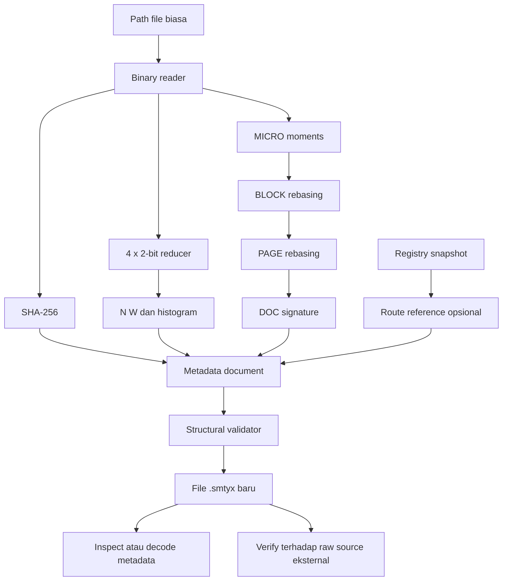

# Arsitektur SMTYX runtime lokal

## Pembaruan 0.2.0 — jalur exact

Runtime kini menyediakan jalur tambahan `encode --exact → SMTYX-EXACT v2 → write`.
`exact_math.py` menyimpan urutan cluster dan base-3 rank bagi pair nonzero;
`exact.py` mengalirkan MICRO/BLOCK/PAGE/DOC dalam record binary, memvalidasi inverse,
moments, histogram, SHA-256 sumber dan checksum container. `atomic.py` menulis ke
file temporary lokal dan mempublikasikannya dengan hardlink create-only setelah
validasi selesai. Target existing tidak diganti; temporary dibersihkan pada error.
Decoder tidak menggunakan source.name atau FILE route sebagai lokasi pengambilan data.

Memori jalur exact dibatasi MICRO/record dan accumulator moments, bukan jumlah
node total. JSON v1, registry, cluster reducer, dan formula moments tetap kompatibel.
`inspect` exact memvalidasi semua record dengan inverse sementara di memori, lalu
mengembalikan ringkasan; `verify` membandingkan bytes inverse dengan sumber eksternal.
`write` dan `decode -o` exact menghasilkan raw file yang telah tervalidasi.

Baseline lama sebelum upgrade disimpan sebagai archive dan manifest hash pada
`log/exact-upgrade-20260917T1324392403069Z/`. Uji nyata memulihkan ZIP 6.508.349 byte
dengan SHA-256 identik dan CRC ZIP lulus, menggunakan audit hook Python yang memblokir
akses decoder ke folder Input. Detail format dan batasnya ada di `FORMAT_EXACT.md`.

Bagian berikut merekam arsitektur **baseline metadata v1**; status "belum raw decoder"
dan "belum binary transport" pada baseline telah diperluas oleh profil exact lokal
di atas. Model/semantic/physical transport adapters tetap belum diimplementasikan.

Originator / initial designer: **@luqmanwah**. Implementasi ini mengambil irisan
byte mathematics, hierarchy, metadata, registry, dan validator dari design-freeze.
Seluruh proses berjalan lokal, deterministik, tanpa model/API/network call.

## 1. Aliran yang sudah berjalan

Pada SMALL, cabang MICRO sampai DOC dilewati. LARGE menghitung signature MICRO
sekali dari raw bytes; parent dibangun dengan rumus translasi positional moments.
Full source tidak perlu ditampung di RAM. Metadata hierarchy tetap disimpan di RAM.

## 2. Komponen kode

| Modul | Tanggung jawab | Batas |
|---|---|---|
| `smtyx/core.py` | Reducer, lookup 256 byte, signature, rebasing, layout, file analysis | Tidak memahami teks/ekstensi/semantik |
| `smtyx/format.py` | Dokumen `.smtyx`, strict validation, summary, verify | Metadata-only; tidak ada raw decoder |
| `smtyx/storage.py` | Bounded UTF-8 JSON read, duplicate-key rejection, exclusive create | Tidak ada update in-place |
| `smtyx/registry.py` | Delapan route class, snapshot revisions, lookup, FILE hash binding | Tidak menjalankan atau mengambil target |
| `smtyx/__main__.py` | CLI argparse, error reporting, dispatch | Tidak memiliki background service |
| `tests/test_runtime.py` | Golden vectors, exhaustive reducer, collision, I/O, CLI, malformed input | Tes lokal, tanpa network/model |

Public API sederhana: `analyze_file`, `signature`, `cluster_index`, `Layout`,
`encode`, `load_document`, `verify_source`, `add_entry`, `resolve`.
API mengembalikan dict/list dan menggunakan `ValueError`/`OSError` pada kegagalan.
CLI menerjemahkan error tersebut menjadi exit 2 dan pesan stderr.

## 3. Pemisahan identitas

1. **Cluster/signature**: fitur/constraints numerik, dapat collision.
2. **Node ID**: koordinat lokal hierarchy, menunjuk node di satu dokumen.
3. **Registry ID**: namespace + revision + route class + index untuk shared mapping.
4. **Content digest**: SHA-256 raw bytes sebagai pemeriksaan integritas kandidat.
5. **Behavioral weights**: konteks desain mendatang, tidak boleh mengubah math state.

Kesamaan pada satu lapisan tidak otomatis membuktikan kesamaan lapisan lain.
Misalnya FILE route dapat menunjuk lokasi baru untuk byte identik; verify tetap
menggunakan isi, sementara nama file tidak menjadi syarat kesamaan.

## 4. Hubungan dengan keseluruhan design-freeze

| Bagian desain | Status pada runtime ini | Tahap berikutnya |
|---|---|---|
| Raw DEC/HEX/BINARY coordinates | Byte arithmetic; tidak membuat Unicode semantic dictionary | Coordinate-set/discriminator schema yang eksplisit |
| Math `[N,P0..P3]` | Implemented di semua node LARGE | Solver dengan bukti keunikan dan additional constraints |
| MICRO/BLOCK/PAGE/DOC | Implemented, rentang raw-byte contiguous | Selective node expansion dengan data store |
| SMALL cluster `[N,W]` | Implemented, seluruh 256 byte diuji | Candidate index dengan collision handling |
| Vocab/path/link/file/SOP/tool/model/state | Immutable registry + lookup implemented | Trusted storage/adapters dan policy execution |
| Macro-token / namespace | Pengguna dapat mendaftarkan ID/name secara manual | Pattern + delta compiler dan grammar |
| Parser `A>READ`, REF A | CLI file metadata saja | Daily-task parser/ref resolver |
| Semantic normalization / dialect | Belum diimplementasikan | Human aliases / canonical task schema |
| GMN / pretest / promotion | Belum diimplementasikan | Evaluasi consensus, one-day-one-learn |
| Adaptive behavioral v1 | Belum diimplementasikan | Behavioral profiles dan prompt compiler |
| Urgent/exact v2 | Batas exactness dinyatakan; solver belum ada | Strict proof/constraints dan escalation policy |
| Smallest-capable routing / big-small handoff | Manual mode saja | Capability matching dan adapter/tool execution |
| State/delta / shared base | Registry reference dasar | Versioned base, explicit deltas dan dependency validation |
| Spectator / heartbeat / orchestrator | Tidak ada daemon dibuat | Observer read-only dan bounded local scheduling |
| Base-100 / family-residue / Morse / RGB | Tidak diimplementasikan | Versioned wire adapters dan transport tests |
| Encryption | Tidak diterapkan; output JSON terbaca | Standard cryptographic transport layer terpisah |
| IoT / safety controller / financial example | Konteks desain saja | Domain-specific controllers dan authorization |
| L0–L7 layer model | Fokus L2 math dan sebagian L5 runtime | Integrasi terpisah per layer |

LARGE/SMALL adalah representasi data. Behavioral v1/v2 adalah kebijakan runtime.
Keduanya tidak menentukan apakah model AI tertentu aktif; implementasi ini tidak
memanggil model sama sekali. Tidak ada klaim penghematan token model dari ukuran JSON.

## 5. Penyimpanan dan resource

Reader binary buffered memakai 32 byte per MICRO default atau 64 KiB per read SMALL.
Histogram memakai lookup table 256 byte, kemudian menghitung 16 bucket.
Analisis LARGE berbiaya O(N) operasi integer; besar integer moments naik bersama
panjang node. Agregasi parent berbiaya O(jumlah node) dengan derajat maksimal 3.
Memori LARGE O(jumlah node + ukuran JSON serialisasi); SMALL O(ukuran read buffer).
Tidak ada GPU, multiprocessing, indexing disk global, atau service permanen.

Preflight menghitung perkiraan jumlah node dari ukuran file untuk menolak alokasi
di atas `--max-nodes`. Input tumbuh diperiksa lagi saat read dan sesudah read.
Peningkatan MICRO mengurangi metadata namun mengurangi resolusi lokasi node.
Default 32 byte mengikuti design-freeze, bukan janji efisiensi storage.

## 6. Validasi dan sumber yang dipercaya

Structural validation meliputi tipe, version/profile, canonical integers, digest
syntax, histogram invariants, node coverage, edges/order, dan moment rebasing.
Metadata-only tidak cukup membuktikan isi sumber. `verify` menghitung ulang kedua
representasi dan SHA-256 dari file yang diberikan pengguna.

Registry target, file basename, link, dan SOP/tool names selalu diperlakukan sebagai
data. Tidak ada eval, shell execution, HTTP fetching, automatic path expansion, atau
raw extraction. Penyediaan route tidak memberi izin eksekusi pada runtime ini.
Hash bukan tanda tangan pengirim; penyediaan trusted source/registry tetap tanggung
jawab sistem integrasi yang kelak dibangun.

## 7. Bukti uji dan acceptance

Tes menggunakan attachment design-freeze asli, fixture binary seluruh rentang byte,
empty/partial/multi-page files, dan direktori temporary untuk semua mutasi uji.
Perhitungan node diuji melawan formula langsung pada slice sumber, bukan hanya
membandingkan encoder dengan decoder yang menggunakan helper sama.

Tes collision menegaskan batas reducer maupun moments. Tes CLI membuktikan proses
file → `.smtyx` → inspect/decode → verify, dan memastikan output existing ditolak.
Fixture disalin tanpa konversi encoding/newline; SHA-256 sebelum/sesudah dicocokkan.
Report hasil aktual dan ukuran output ada di `examples/VALIDATION.md`.

## 8. Ruang pengembangan selanjutnya

Tahap exact perlu spesifikasi discriminator/order/coordinate yang konkret dan
round-trip test arbitrary binary. Kandidat solusi matematis harus dibuktikan
unik; ambiguous/unsatisfiable wajib dilaporkan. Shared-reference retrieval perlu
trusted registry dan integritas data. Semantic execution memerlukan parser,
capability registry, policy, tool adapters, lalu receipt verifikasi hasil.
Setiap tahap memiliki kontrak sendiri; tidak dianggap selesai hanya karena
metadata, ID, atau status ACCEPTED sudah tersedia.
